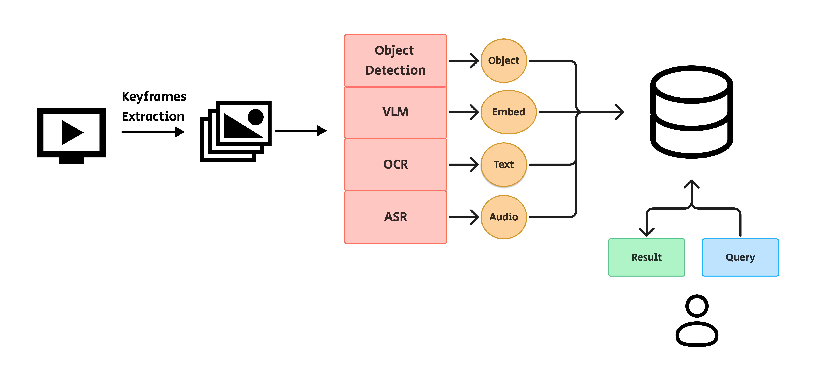

# Retrieval System Development

## 📚 Knowledge Foundation

Building a robust retrieval system requires combining **database technology**, **embedding models**, and **deployment practices**. Below are the core concepts:

* **Database for Vector Search**

  * We use [Milvus](https://milvus.io/docs), a high-performance vector database optimized for similarity search and retrieval.
  * Milvus supports scalable indexing, hybrid queries, and integration with deep learning pipelines.

* **Embeddings Model**

  * To represent text, images, or multimodal data in vector space, we leverage [OpenCLIP](https://github.com/mlfoundations/open_clip).
  * OpenCLIP provides pre-trained models that map raw inputs into dense embeddings, enabling semantic similarity and retrieval tasks.

* **Additional Knowledge Components**

  * **Object Detection**: for identifying key regions in images/videos.
  * **OCR (Optical Character Recognition)**: for extracting text from images.
  * **ASR (Automatic Speech Recognition)**: for transcribing audio content into text.
  * **Feature Extraction Pipelines**: for preprocessing data into embeddings ready for indexing.

---

## 🚀 Roadmap for Development & Deployment

1. **Data Preparation**

   * Collect multimodal data (text, images, video, audio).
   * Apply preprocessing: object detection, OCR, ASR as needed.
   * Extract embeddings using OpenCLIP or task-specific encoders.

2. **Database Setup**

   * Deploy Milvus cluster (Docker or Kubernetes recommended).
   * Define schema: collection name, vector dimension, metadata fields.
   * Insert and index embeddings in batches.

3. **Backend Development**

   * REST API or gRPC service for querying Milvus.
   * Integration with model inference (feature extraction + embeddings).
   * Query routing: hybrid search (vector + keyword).

4. **Frontend Development**

   * UI for uploading/querying content (image, text, audio).
   * Display ranked retrieval results with previews.
   * Visual debugging tools (filmstrips, video keyframes, previews).

5. **Deployment & Scaling**

   * Containerize backend/frontend (Docker).
   * Orchestrate services with Docker Compose or Kubernetes.
   * Set up monitoring/logging for embeddings, DB performance, and queries.

---

## 🔍 Current Codebase Overview

Your project already includes multiple features that serve as a foundation:

* **Frontend**

  * Video panel with HLS.js streaming.
  * Filmstrip preview for frames.
  * Interactive annotation/seek functions.
  * JSON-based frame-rate mapping for precise time navigation.

* **Backend**

  * Keyframe extraction script (with feature embeddings).
  * Milvus integration for vector insertion.
  * Batch processing with configurable flush intervals.
  * Torch + OpenCLIP for embeddings extraction.

> ⚠️ Note: Many of these components won’t run **out-of-the-box**. They require properly prepared object detection, OCR, ASR models, and data pipelines before achieving full retrieval functionality.

---

## 📂 Folder Structure & References

Each subdirectory contains its own `README.md` with detailed instructions:

* [`frontend/`](./frontend/README.md) → HTML + CSS + JAVASCRIPTS for UI and retrieval visualization.
* [`backend/`](./backend/README.md) → APIs, Milvus integration, and embedding pipeline.
* [`database/`](./database/README.md) → Milvus schema definitions, scripts, and indexing workflows.

---

## 📖 References

* Milvus: [https://milvus.io/docs](https://milvus.io/docs)
* OpenCLIP: [https://github.com/mlfoundations/open\_clip](https://github.com/mlfoundations/open_clip)

---

✅ This README gives your collaborators and future contributors both the **conceptual knowledge** and the **practical roadmap** to extend your current code into a working retrieval system.
