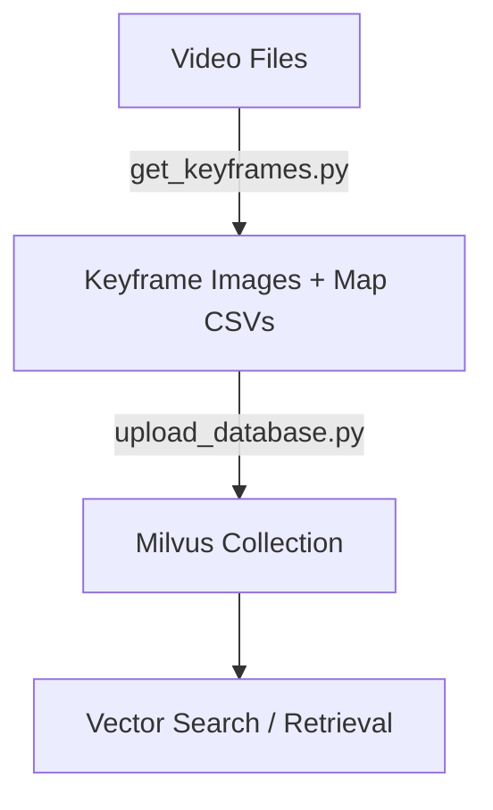

# Video Keyframe Extraction & Embedding Indexing

This repository provides a pipeline for:

1. **Extracting visual keyframes** from videos using [OpenCLIP](https://github.com/mlfoundations/open_clip) similarity filtering.
2. **Indexing extracted keyframes into [Milvus](https://milvus.io/)** for efficient similarity search and retrieval.

---

## 1. Database: Milvus

[Milvus](https://milvus.io/) is a high-performance vector database designed for similarity search.
In this project, it stores embeddings for keyframe retrieval.

* We use **HNSW (Hierarchical Navigable Small World Graph)** indexing with **cosine similarity**.
* Schema:

  * `id`: Primary key (INT64)
  * `filepath`: Path to keyframe image
  * `embedding`: 1024-dim float vector (from OpenCLIP)
  * `video_id`: Parent video folder
  * `frame_id`: Frame index in original video

For advanced Milvus features (e.g., partitioning, hybrid search, scaling, query optimization), see the official docs:
👉 [Milvus Documentation](https://milvus.io/docs)

---

## Pipeline Overview



---
## 2. Run Milvus with Docker Compose
This repo includes a ready-to-use **Docker Compose** file to start Milvus and its dependencies.  
If you haven't installed Docker yet, install **Docker Engine** and **Docker Compose v2** on your machine.

### What this Compose file starts
- **etcd** (`quay.io/coreos/etcd:v3.5.18`)
- **environment**
- **volumes**
- **healthcheck**
- **minio** (`minio/minio:RELEASE.2024-12-18T13-15-44Z`)
- **ports**
- **standalone** (`milvusdb/milvus:v2.6.2`)
- **security_opt**
- **depends_on**
- **default**
### Quick start

From the repository folder that contains `docker-compose.yml`:

```bash
# 1) Start in the background
docker compose up -d

# 2) Watch status
docker compose ps

# 3) Tail logs (Ctrl+C to stop tailing)
docker compose logs -f
```

When everything is healthy, Milvus should accept connections on **port 19530** (gRPC) and **port 9091/9092** (HTTP REST, if exposed).

### Verify the connection (Python)

```python
from pymilvus import connections, utility
connections.connect("default", host="127.0.0.1", port="19530")
print("Connected:", utility.get_server_version())
```

> Tip: If you run Milvus in the cloud or a remote server, replace `127.0.0.1` with the server IP/hostname and make sure the port is open in your firewall.

### Stop & clean up

```bash
# stop containers but keep data
docker compose stop

# restart containers
docker compose start

# stop and remove containers (data persists)
docker compose down

# stop and remove containers + **delete all volumes/data**
docker compose down -v
```
---

## 3. Keyframe Extraction

**Script:** `get_keyframes.py`

This script processes a folder of videos, extracts representative keyframes based on cosine similarity of OpenCLIP embeddings, and saves:

* Keyframes as **`.webp` images**
* Frame-to-time mappings as **CSV files**

### Usage

```bash
python get_keyframes.py \
  --input-folder /path/to/videos \
  --output-base ./output-keyframes \
  --clip-threshold 0.93 \
  --skip-frames 5
```

### Key Arguments

* `--input-folder`: Root folder containing videos (`.mp4` by default).
* `--output-base`: Where keyframes and maps will be stored.
* `--clip-threshold`: Cosine similarity threshold (lower similarity → new keyframe).
* `--skip-frames`: Process every `(skip_frames + 1)`th frame.
* `--pattern`: Glob pattern for video files (default: `*.mp4`).

Each processed video produces:

```
output-keyframes/
  ├── maps/
  │   └── video1_map.csv
  ├── video1/
  │   └── keyframes/
  │       ├── keyframe_150.webp
  │       ├── keyframe_300.webp
  │       └── ...
  └── video2/
      └── keyframes/...
```

---

## 4. Milvus Indexing

**Script:** `upload_database.py`

This script takes the extracted keyframes (`.webp`) and inserts their embeddings into a Milvus collection for fast vector similarity search.

### Features

* Multi-GPU or CPU-only encoding
* Batch-wise insertion with configurable flush interval
* Automatic collection creation with HNSW index
* Option to rebuild index after ingestion for faster queries

### Usage

```bash
python upload_database.py \
  --root ./output-keyframes \
  --collection-name AIC25_fullbatch1 \
  --recreate \
  --build-index
```

### Key Arguments

* `--root`: Root folder containing keyframes.
* `--collection-name`: Milvus collection name.
* `--recreate`: Drop and recreate the collection if it exists.
* `--build-index`: Build HNSW index after insertions.
* `--batch-size`: Number of keyframes per encoding batch (default: 16).
* `--flush-interval`: Flush every N inserts (default: 2000).
* `--workers`: `auto` = use all GPUs, `cpu` = single worker on CPU, or integer for #workers.

---

### Common issues & fixes

- **Permission denied on volumes**: On Linux, make sure the directory you bind-mount is writable by Docker. You can `chown -R 1000:1000 <data_dir>` if containers run as uid 1000, or use `:z` on SELinux systems.
- **Ports already in use**: Change the left side of the `host:container` port mapping in `docker-compose.yml`, e.g. `19531:19530`.
- **Low memory**: Milvus standalone typically needs at least **4–8 GB RAM**. Try closing other apps or upgrading memory if OOM occurs.
- **ARM Macs**: If the image doesn’t support ARM, add `platform: linux/amd64` to the service in `docker-compose.yml`.
- **Remote access blocked**: Ensure your firewall/security group allows inbound TCP on the Milvus port (default **19530**) from your client.

### Where to go next

- Create collections and insert vectors using our scripts in this repo (see sections above).
- Learn advanced features (partitions, indexes, query tuning, backup) in the official docs: https://milvus.io/docs

## Requirements

* Python 3.9+
* CUDA-enabled GPU(s) recommended for speed
* Libraries: `torch`, `open_clip_torch`, `tqdm`, `pymilvus`, `PIL`, `opencv-python`

Install dependencies:

```bash
pip install torch torchvision tqdm opencv-python pillow pymilvus open_clip_torch
```

---

✅ With this pipeline:

* You can extract **compact sets of representative frames** from large video datasets.
* Store them in **Milvus** for fast semantic search and retrieval.

